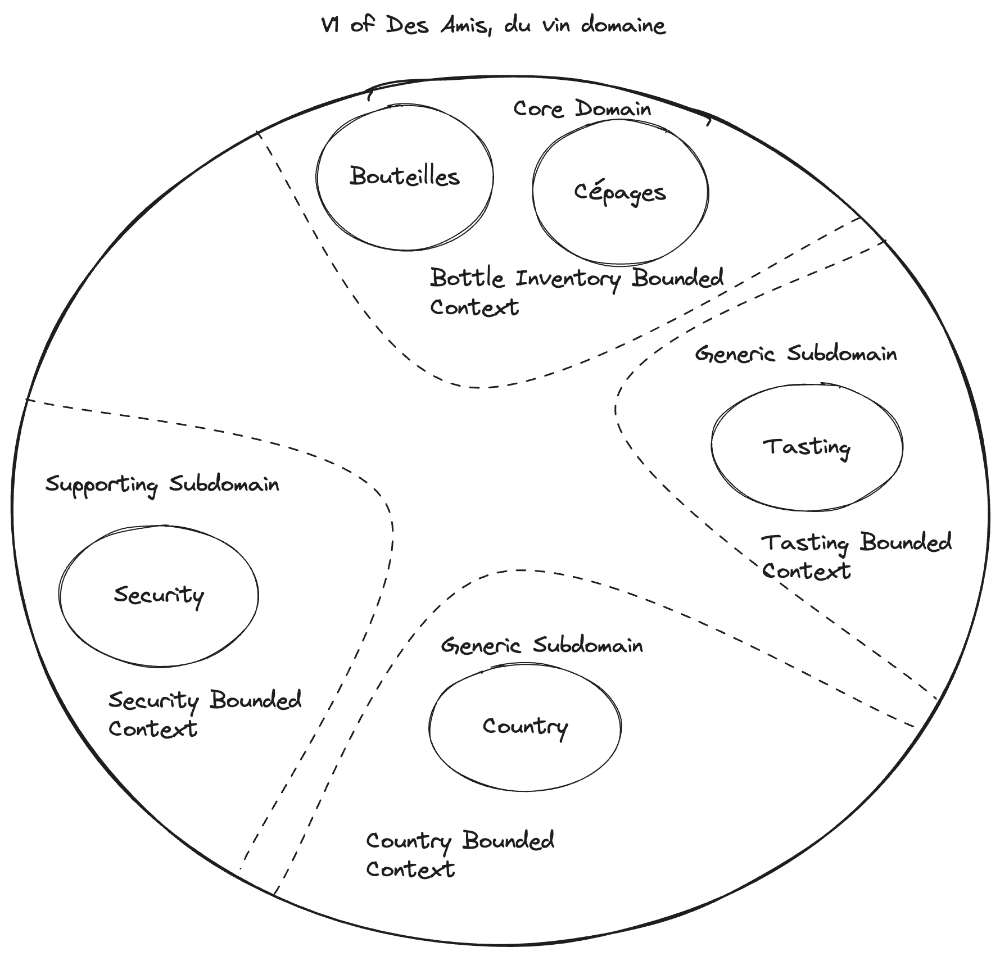
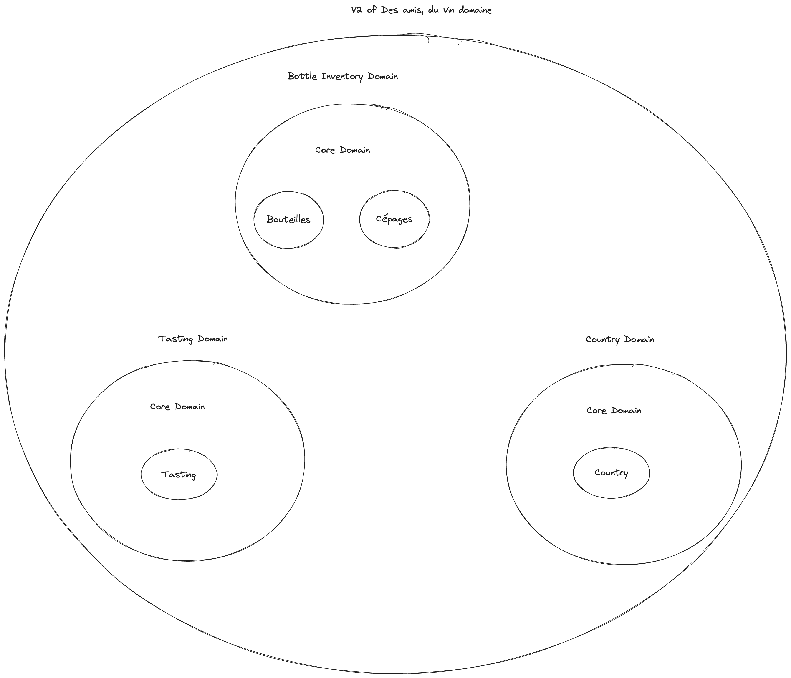

# User - Des amis, du vin

## Distillation document (in French)

Se connecter via un système d'authentification
Créer un utilisateur si on a réussi à se connecter et qu'il n'existe pas dans la base de données
Un utilisateur doit être constitué d'un email et d'un full name
Un utilisateur doit pouvoir en ajouter un autre en amis, s'il n'est pas déjà présent dans sa liste d'amis
Un utilisateur doit pouvoir accepter une invitation d'un autre utilisateur
Un utilisateur doit pouvoir refuser une invitation d'un autre utilisateur
Un utilisateur doit pouvoir retirer un ami de sa liste d'amis

### Adapter Test
We use Behat. To run behat use:
<pre>
  make adapter-test
</pre>

### Unit Test
We use PHPUnit. To run unit test use:
<pre>
  make unit-test
</pre>

### Makefile
To see all usefull command run:
<pre>
  make help
</pre>

## Database management
We used a dump to reload faster our database. To load your database use:
<pre>
  make db-load-fixtures
</pre>

### Update dump
If you add some migration or some fixtures, you have to update your dump with:
<pre>
   make db-reload-fixtures
</pre>

## Quality of our code
We have some quality tools and to run all this tools, you can use:
<pre>
  make code-quality
</pre>
In our quality tools you can find:

### Security checker of symfony
This tools check, if you have vulnerability in your dependencies
<pre>
  make security-checker
</pre>

### Yaml Linter
<pre>
  make yaml-linter
</pre>

### Xliff Linter
<pre>
  make xliff-linter
</pre>

### Twig Linter
<pre>
  make twig-linter
</pre>

### Container Linter
<pre>
  make container-linter
</pre>

### PHPStan
<pre>
  make phpstan
</pre>

### Rector
<pre>
  make rector
</pre>

### CS Fixer
This tools check if you have error in your coding styles.

To show this error use:
<pre>
  make cs
</pre>

To fix this errors use:
<pre>
  make cs-fix
</pre>

### Validate database schema
This Symfony command check if your database schema is coherent with your entities annotation
<pre>
  make db-validate
</pre>

## Mailcatcher
If your local app send mail, your mail will be catched by the mailcatcher.
To see this mail go to: https://mailcatcher.du-vin-des-amis.docker

## Naming rules
- Entity class shouldn't have suffix
- Value object class shouldn't have suffix
- Enum class shouldn't have suffix
- Event class shouldn't have suffix
- Event listener class shouldn't have suffix
- Exception class should have suffix
- Service class shouldn't have suffix
- Repository class should have suffix
- Command/Query class should have suffix
- Command/Query handler class should have suffix

## Value object rule
- Id method should be named value
- Value object should be immutable

## Architecture rules
- Each Domain should have its own folder
- Each Entity is responsible for it's state so they must recreate the value object of a property when they must be changed
- Domain never should have a dependency with another domain except Shared, to avoid to have dependency between domain
- Transaction for CommandHandler are started in the MessengerCommandBus
- Each Exception in Adapter should be logged
- An Adapter should always dispatch a command or a query
- An Aggregate should only be modified by the Aggregate himself children Entity should be modified by the Aggregate
- An Aggregate should only have one repository
- An Aggregate and Entity should always be created by a factory (method or class)
- An Aggregate or Entity action (domain method) should always dispatch an event
- All Aggregate attributes except boolean should be a ValueObject
- EventListener should always be in the Application or Infrastructure layer
- All Aggregate and Entity should have a created at, created by, updated at and updated by
- All Aggregate and Entity method should be Unit tested
- All Adapter (Contract or Driving) method should be Contract or Driving tested
- If we need to read information from Aggregate without Aggregate we should use a read model
- To request an external api we should use a Repository, then an adapter is created to use this repository and use a translator
to transform this data to our domain
- One resource class by operation

### Refactoring user

Add friend system + invitation....

User context is responsible to send notification when invitation is sent

Extract it in a microservice and a new project

Add a fullname to user

## Refactoring tech
Refactorer le AuthenticateUserCommandHandler pour utiliser le pattern Stratégie au lieu d'appeler chaque méthode. => minor

Reflect to add test on command handler and query handler => Va être nécessaire use kernel test case
